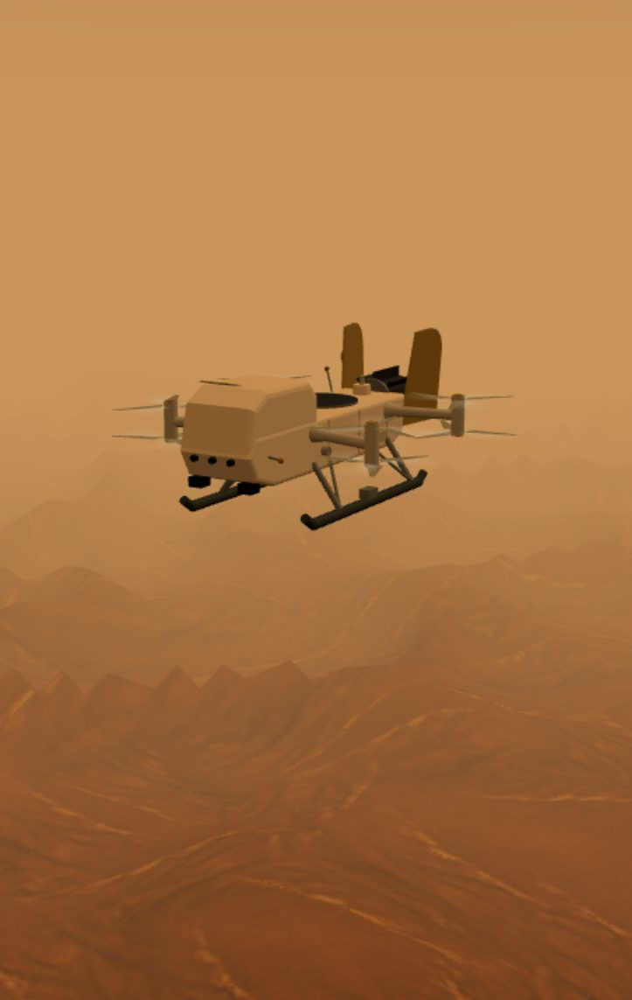
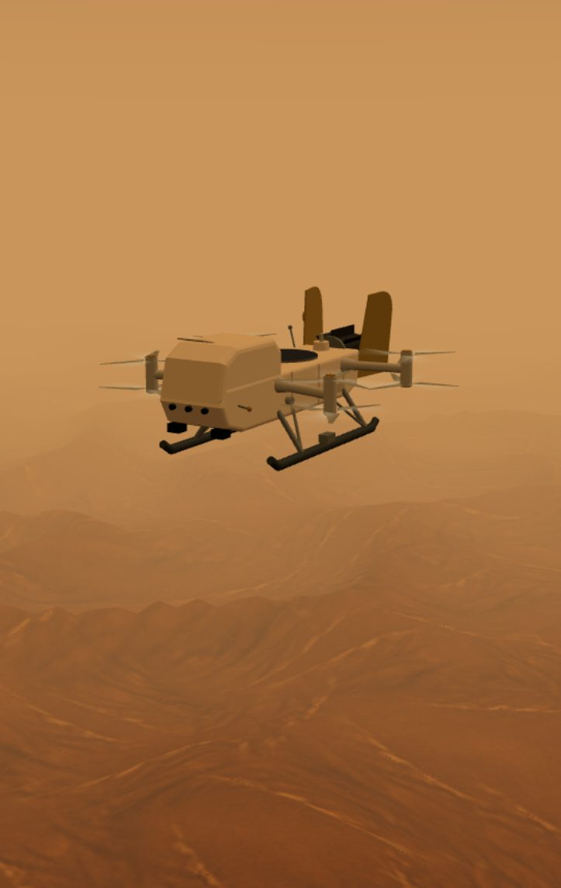
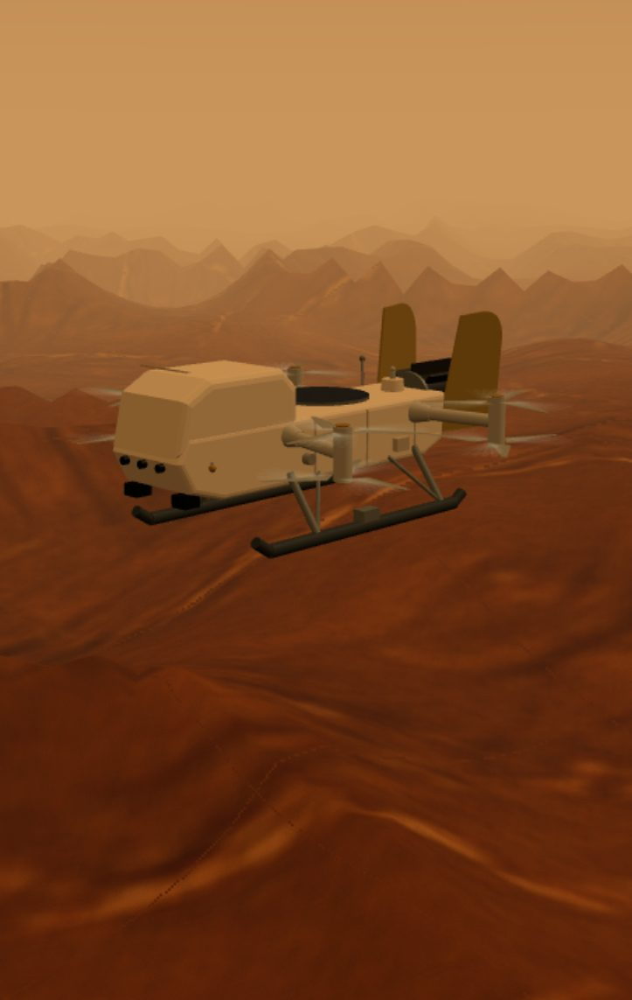
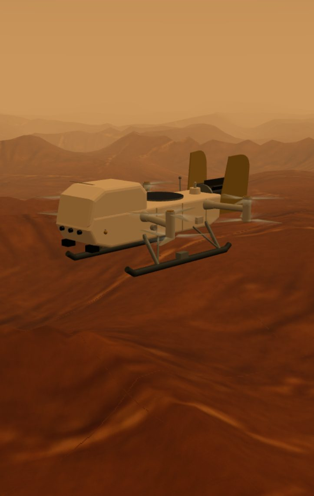
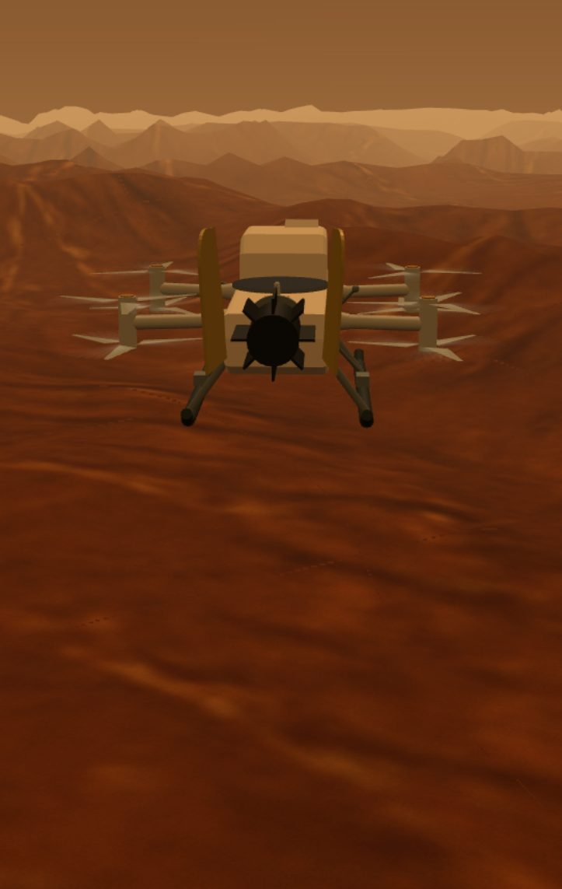
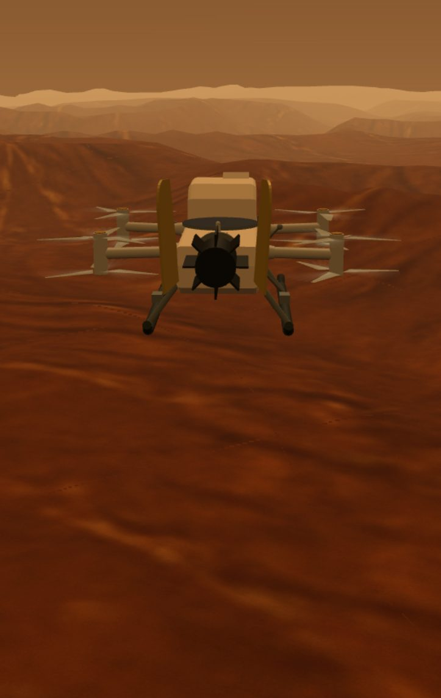

# Archived style: classic sharp-peak terrain

Until 2026-09-29 the distant mountains had sharp, saw-tooth peaks. The owner liked that look,
so it is archived here even though the live app now uses smoother far terrain for realism
(Titan's mountains are thought to be worn down by methane rain).

## Where the look came from

The sharp tops were not a separate design. The ground mesh gets coarse away from the vehicle
(up to ~80 m between points), and sampling sharp ridge crests and fine bumps that coarsely made
single points stand up as triangular teeth. The terrain function itself is the same in both
styles; only the far, coarse part of the mesh differs.

## Pictures

| | Classic (archived) | Smoothed (live) |
|---|---|---|
| Landing, 43 s |  |  |
| Landing, 50 s |  |  |
| 120 m up near Site F |  |  |

## Getting it back

- **Whole app as it was:** git tag `archive/classic-peaks-terrain` (commit 63eb373, the last
  version before the smoothing). `git checkout archive/classic-peaks-terrain`, then serve `dist/`.
- **Just the peaks, in the current app:** in `dist/titan-terrain.mjs` change
  `const farDetail = (cell) => smoothUnit((cell - 20) / 12);` to `const farDetail = () => 0;`.
  With that, every terrain height is exactly the classic one (checked on 20,000 points), and the
  newer background rebuild when crossing into a new 400 m square stays.
